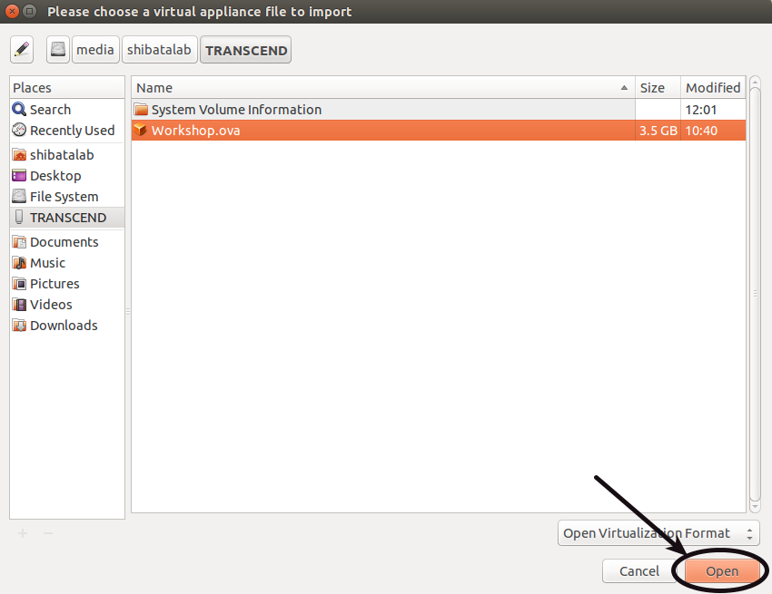

This page explains the various steps that you have to do before attending the workshop:

## Software Environment Setup

* Please prepare a Laptop with these minimum requirements for doing the exercises:
  - Intel i3 Processor
  - 2 GB RAM

* Download VirtualBox software from [here](https://virtualbox.org/wiki/Downloads) and install the software on your laptop.

* Copy the Ubuntu 14.04 VirtualBox image from the shared PC of ShibataLab to your Laptop. The file is available in the **Desktop\Workshop** folder titled **Workshop.ova**.

* Open the VirtualBox software and import the Ubuntu image as shown below:
  - Open VirtualBox:
  
  
  
  - Import Appliance:
  
  
  
  - Open the OVA file:
  
  
  
  - Start importing:
  
  
  
  - Start Ubuntu 14.04:
    
  

With this you have finished setting up the software environment for Linux.

## Getting used to Ubuntu

Ubuntu is a free Operating System that is based on the Linux kernel. In the workshop, we will be using the Command Line Interface (CLI) called **Terminal**.

Please read these tutorial pages to get used to Terminal:

* **日本語**: [Official](https://wiki.ubuntulinux.jp/UbuntuTips/Others/HowToUseTerminal), [Part 1](http://blog.livedoor.jp/hiroumauma/archives/957224.html#more), [Part 2](http://blog.livedoor.jp/hiroumauma/archives/958159.html#more), [Part 3](http://blog.livedoor.jp/hiroumauma/archives/968446.html#more).

Please comment at the bottom of this page, if you know a better tutorial to learn about Terminal.

* **English**: [Official](https://help.ubuntu.com/community/UsingTheTerminal). 

## Getting used to Git/Github

One of the workshops will be on Version Control Software called [Git](http://git-scm.com/) and on the Git online interface called [Github](http://github.com).

For accessing the materials of the workshop, you need to create an account on the Github website:

* Please create a Github account from this [link](https://github.com/). 
* Follow the user **shibatalab** from this [link](https://github.com/shibatalab) as shown in the figure below:

  
