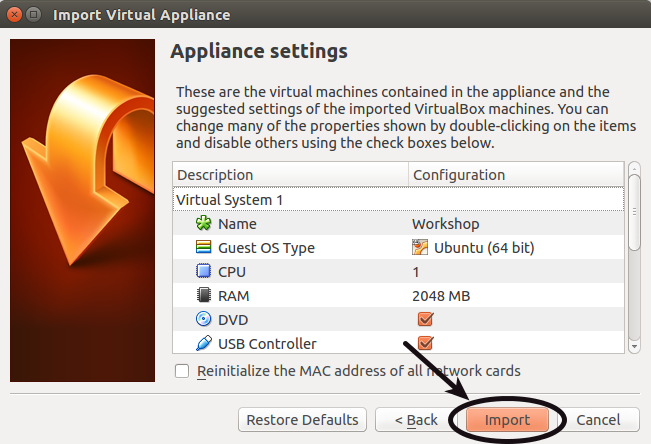

This page explains the various steps that you have to do before attending the workshop:

* Table of Contents:
{:toc}

---

## Software Environment Setup

* Please prepare a Laptop with these minimum requirements for doing the exercises:
  - Intel i3 Processor
  - 2 GB RAM

* Download VirtualBox software from [here](https://virtualbox.org/wiki/Downloads) and install the software on your laptop.

* Copy the Ubuntu 14.04 VirtualBox image from the shared PC of ShibataLab to your Laptop. The file is available in the **Desktop\Workshop** folder titled **Workshop.ova**.

* Open the VirtualBox software and import the Ubuntu image as shown below:
  - Open VirtualBox:
  
  
  
  - Import Appliance:
  
  
  
  - Open the OVA file:
  
  
  
  - Start importing:
  
  
  
  - Start Ubuntu 14.04:
    
  

* This will start Ubuntu operating system. The login password is **workshop** and the sudo password is also **workshop**.

With this you have finished setting up the software environment for the workshops.

---

## Installing Matlab in Ubuntu

The exercises for [Machine Learning]({{site.baseurl}}/ML) and [Motion Capture]({{site.baseurl}}/Mocap) workshops will be conducted in Matlab. For this, you will have to install Matlab on the Ubuntu virtual image:

* Open a web browser and go to the [mathworks website](http://jp.mathworks.com/) and create a mathworks account.

* Obtain a trial license for using Matlab from the website.

* Open a terminal window by using the shortcut **Alt+Ctrl+t** or pressing the terminal icon and type in the following commands:


cd ~/Downloads/Matlab/
sudo ./install


  You will be asked to enter the sudo password which is **workshop**.

* When the Matlab installer opens, follow the instructions to complete the installation:

  - Install the software using your Mathworks account:
  

  - Enter mathworks account details:
  

  - Installation progress:
  

* After installation, you will need to verify the matlab license one more time:

* To start using Matlab, open a new terminal and type in the following command:


./matlab


---

## Getting used to Ubuntu

Ubuntu is a free Operating System that is based on the Linux kernel. In the workshop, we will be using the Command Line Interface (CLI) called **Terminal**.

Please read these tutorial pages to get used to Terminal:

* **日本語**: [Official](https://wiki.ubuntulinux.jp/UbuntuTips/Others/HowToUseTerminal), [Part 1](http://blog.livedoor.jp/hiroumauma/archives/957224.html#more), [Part 2](http://blog.livedoor.jp/hiroumauma/archives/958159.html#more), [Part 3](http://blog.livedoor.jp/hiroumauma/archives/968446.html#more).

Please comment at the bottom of this page, if you know a better tutorial to learn about Terminal.

* **English**: [Official](https://help.ubuntu.com/community/UsingTheTerminal). 

---

## Getting used to Matlab

Matlab is a computing software that is used in many fields of Science and Engineering. To learn the Matlab platform, you can refer to the following resources:

* **日本語**: [Official](http://jp.mathworks.com/academia/student_center/tutorials/launchpad.html?s_cid=embvid_matlab_rr_2_matlab_tutorial_JP).

Please comment at the bottom of this page, if you know a better tutorial to learn about Matlab.

* **English**: [Official](http://www.mathworks.com/academia/student_center/tutorials/launchpad.html?s_tid=gn_loc_drop).

---

## Getting used to Git/Github

One of the workshops will be on Version Control Software called [Git](http://git-scm.com/) and on the Git online interface called [Github](http://github.com).

For accessing the materials of the workshop, you need to create an account on the Github website:

* Please create a Github account from this [link](https://github.com/). 
* Follow the user **shibatalab** from this [link](https://github.com/shibatalab) as shown in the figure below:

  

* Practice editing the contents of this [site](http://shibatalab.github.io) from the Github website as shown below:
  - Open a browser and go to Github website and login with your account.

  - Go to the repository of this [site](https://github.com/shibatalab/GW2015Workshop) and check the contents of the repository.

  - Edit the contents of this page available at this [link](https://github.com/shibatalab/GW2015Workshop/blob/gh-pages/_posts/2015-4-24-Prerequisites.md) and read the raw content of this page.

---

## Comment below

If you have completed all the steps required for attending the workshops, then please comment below with your name. Also please comment if you have any problems with the steps.    