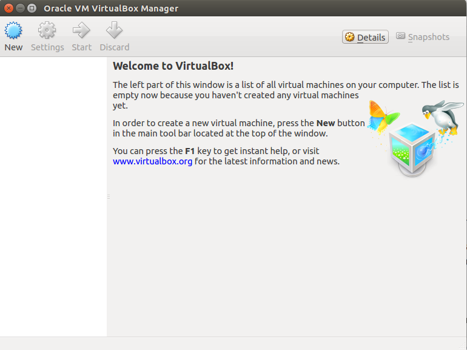

This page explains the steps that you have to do before attending the workshop:

## Software Environment Setup

* Please prepare a Laptop with these minimum requirements for doing the exercises:
  - Intel i3 Processor
  - 2 GB RAM

* Download VirtualBox software from [here](https://virtualbox.org/wiki/Downloads) and install the software on your laptop.

* Copy the Ubuntu 14.04 VirtualBox image from the shared PC of ShibataLab to your Laptop. The file is available in the **Desktop\Workshop** folder titled **Workshop.ova**.

* Open the VirtualBox software and import the Ubuntu image as shown below:
  - Open VirtualBox:
  
  
  
  - Import Appliance:
  
  
  
  - Open the OVA file:
  
  
  
  - Start importing:
  
  
  
  - Start Ubuntu 14.04:
    
  

With this you have finished setting up the software environment for Linux.

## Getting used to Ubuntu

Ubuntu is a free Operating System that is based on the Linux kernel. 

  