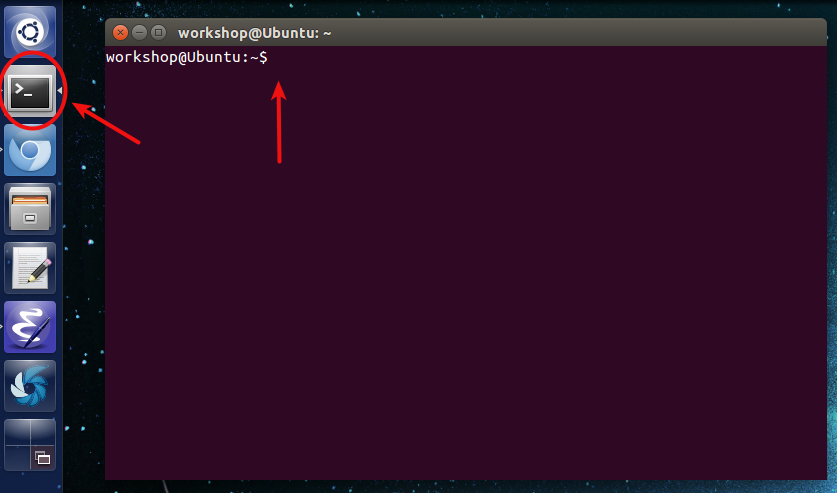

This page explains the installation of Matlab on the Ubuntu Virtual Box image.

* Table of Contents:
{:toc}

---

### Installing Matlab in Ubuntu　（UbuntuでのMatlabのインストールの方法）

Exercises for [Machine Learning]({{site.baseurl}}/ML) and [Motion Capture]({{site.baseurl}}/Mocap) workshops will be conducted in Matlab. For this, you will have to install Matlab on the Ubuntu virtual image.　（”Machine Learning”と"Motion capture"はMatlabが必要です．MatlabをUbuntuにインストールしてください．）

* Open a web browser and go to the [mathworks website](http://jp.mathworks.com/) and create a mathworks account.　（MathworksのウェブサイトでMathworksのアカウントを作ってください．）

* Obtain a trial license for using Matlab from the website.　（製品評価版を入手してください．）

* Open a terminal window by using the shortcut **Alt+Ctrl+t** or pressing the terminal icon and type in the following commands. You will be asked to enter the sudo password which is **workshop**.　（ショートカットキー”Alt+Ctrl+t”もしくはターミナルアイコンを押してください．次のコマンドを入力してください．必要なパスワードは”workshop”です．）


cd ~/Downloads/Matlab/
sudo ./install


* When the Matlab installer opens, follow the instructions to complete the installation.　（Matlabのインストーラーを開いたら、次の手順でインストールしてください．）

  - Install the software using your Mathworks account:

  

  - Enter mathworks account details:

  

  - Installation progress:

  

  - After installation, you will need to verify the matlab license one more time:

  

* To start using Matlab, open a new terminal and type in the following command.　（Matlabを起動するには新しいターミナルで次のコマンドを入力してください．）


./matlab


---

### Getting used to Matlab

Matlab is a computing software that is used in many fields of Science and Engineering. To learn the Matlab platform, you can refer to the following resources:

* **日本語**: [Official](http://jp.mathworks.com/academia/student_center/tutorials/launchpad.html?s_cid=embvid_matlab_rr_2_matlab_tutorial_JP).

Please comment at the bottom of this page, if you know a better tutorial to learn about Matlab.

* **English**: [Official](http://www.mathworks.com/academia/student_center/tutorials/launchpad.html?s_tid=gn_loc_drop).
